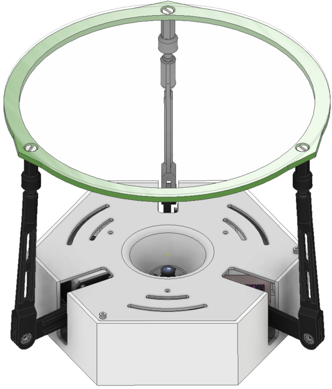
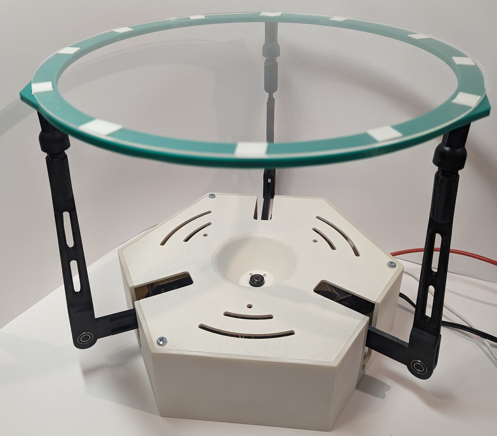
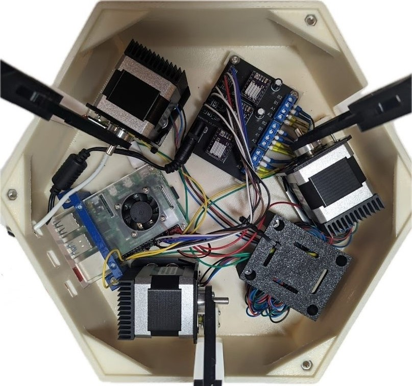
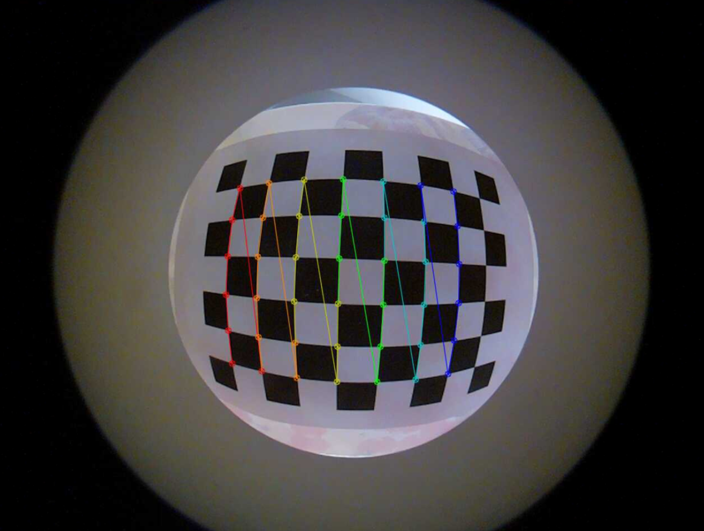
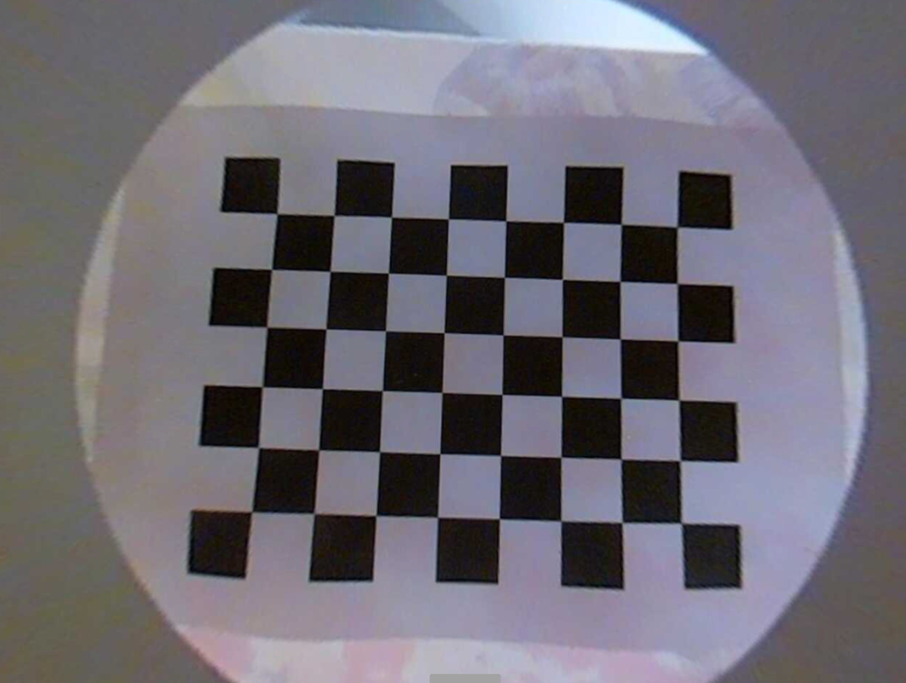
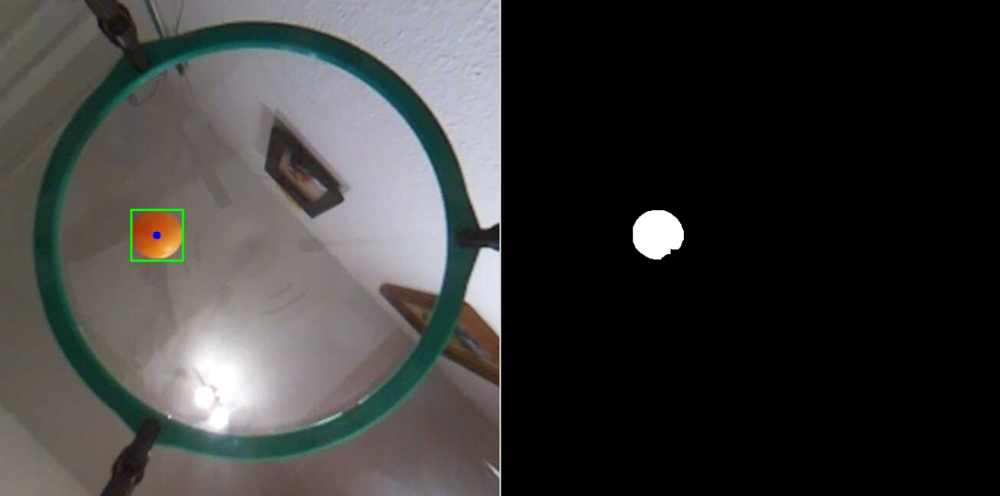
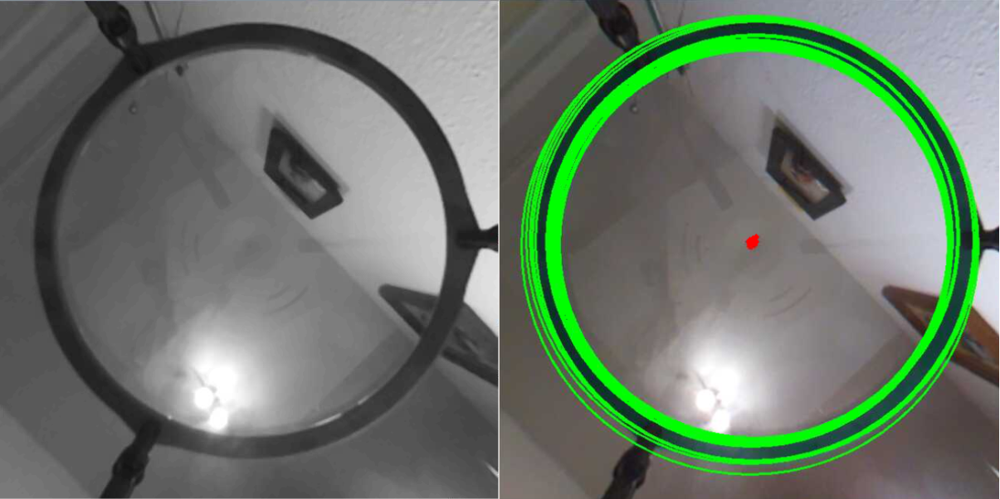
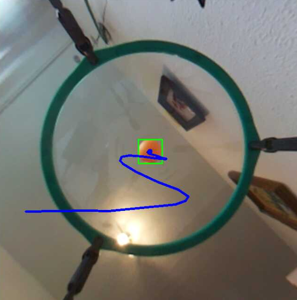

# 3RRS-ball-ballancing-platform

This repository contains everything needed to create a 3RRS manipulator capable of controlling a ball on a platform using a camera and a PID controller. Programs for the Raspberry Pi 4B are written in Python, and there is also a MATLAB simulation of the model's reverse kinematics. This project was developed as my bachelor thesis and successfully defended at WUST in 2024.

Short video of constructed robot : https://youtu.be/mO_4qzWjOGI

  

The project shown above was created in Inventor. All files essential for building this robot can be found in the `/inventor_parts_and_model` directory, and the STL files are located in the `/STL_models` directory. Parts that are not included in these directories, such as ball joints or the plexiglass top, were purchased instead of 3D printed. 
On the pictures below you can see parts used to create the robot:

  
  

- Raspberry pi 4b 8GB RAM
- DRV8825 stepper motor driver
- JK42HS40-0404 200 steps 12V/0,4A/0,4Nm stepper motor
- HD M OV5647 5Mpx Camera (fisheye lens)

 PCB board was designed for this project, and its schematic can be found in the `images` directory.

## Matlab simulation

The `simulation.m` file contains a visualization of the platform's circular movement. It helps to understand how inverse kinematics works by analyzing movements with different parameters.

## Camera calibration

A wide-angle camera was used to lower the construction and set everything inside one box. This caused significant image distortion. To manage this, the `/camera_calibration` directory contains two files. The first one, `calibrate.py`, helps to find the camera matrices needed to undistort images. To find these values, you should take photos of a chessboard and put them into the same directory before running the script. The second file, `undistort.py`, shows the image after the undistortion procedure and should be run with the command `undistort.py image_name`.

  
  

Images befor and after camera calibration.

## Scripts

The `scripts` directory contains all the scripts needed to run the platform. Each file is responsible for different functions, which are composed in the `main.py` function.

- `calc.py` is responsible for calculating the inverse kinematics of the manipulator.
- `camera.py` handles all detection tasks, such as finding the ball or the center of the platform. These functionalities are shown in the pictures below.

  

  

- `move32.py` manages all robot movements, such as setting the ground position parallel to the base and reating for ball movement.
- `pid.py` contains the PID regulator algorithm.
- `main.py` sets everything up and runs the program. To see a live view of the camera, as shown below, you should run `main.py --show-trajectory`.

  

## Other information

Because of the fisheye lens and significant image distortion, the Raspberry Pi 4B 8GB manages to run the program at about 15 frames per second. To increase FPS, ARM NEON and ARM VFPV3 technologies were used. For projects of this kind, you should consider using at least a Raspberry Pi 5 if a fisheye lens is used. It is also likely that this program can be optimized for better performance.

